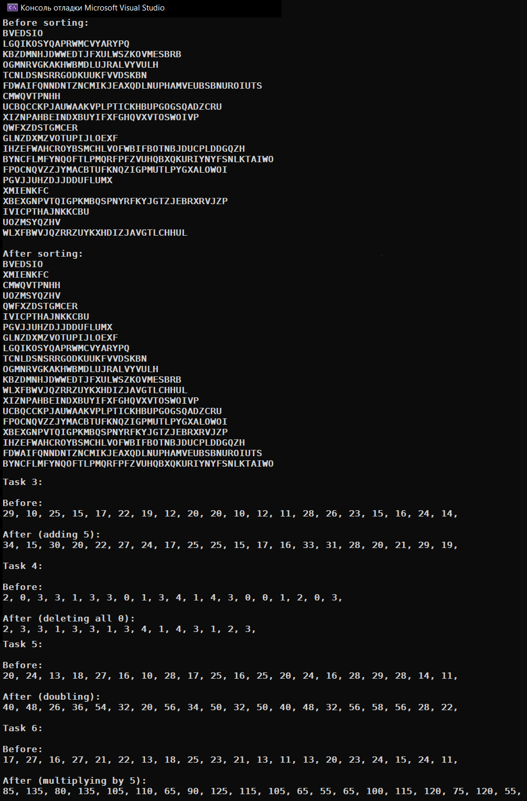

# Homework_17.05.2023
Д/з: predicates and functors

<a href="https://gist.github.com/SlavikArt/c5d3857226fe009b8592b624b3bc0f81">Gist - страница со всеми кодами проектов</a>

* [main](main)

    <h2>Main</h2>
    

    

